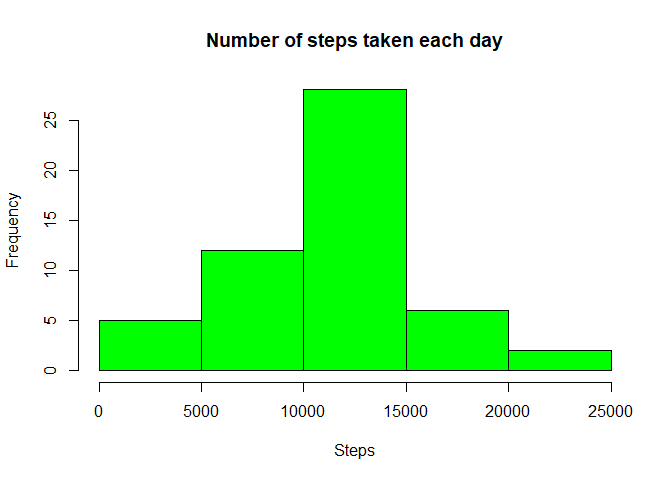
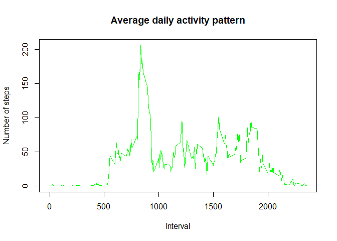
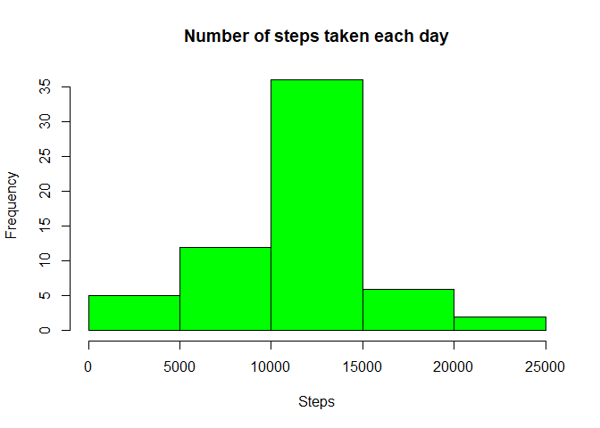
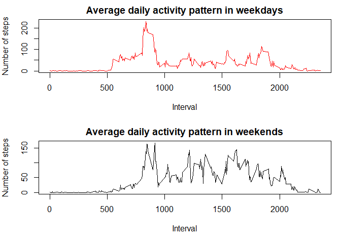

## Loading and preprocessing the data

```r
data<-read.csv("activity.csv", sep = ",", header = T)
str(data)
```

```
## 'data.frame':	17568 obs. of  3 variables:
##  $ steps   : int  NA NA NA NA NA NA NA NA NA NA ...
##  $ date    : chr  "2012-10-01" "2012-10-01" "2012-10-01" "2012-10-01" ...
##  $ interval: int  0 5 10 15 20 25 30 35 40 45 ...
```
### Date format configuration

```r
library(lubridate)
```

```
## 
## Attaching package: 'lubridate'
```

```
## The following objects are masked from 'package:base':
## 
##     date, intersect, setdiff, union
```

```r
data$date<-ymd(data$date)
str(data)
```

```
## 'data.frame':	17568 obs. of  3 variables:
##  $ steps   : int  NA NA NA NA NA NA NA NA NA NA ...
##  $ date    : Date, format: "2012-10-01" "2012-10-01" ...
##  $ interval: int  0 5 10 15 20 25 30 35 40 45 ...
```
## What is mean total number of steps taken per day?
- Histogram of the total number of steps taken each day:

```r
data2<-with(data, tapply(steps, date, sum))
res<-data.frame(Date=ymd(names(data2)), Steps=data2)
hist(res$Steps, col="green", main = "Number of steps taken each day", xlab= "Steps")
```

<!-- -->


- Mean and median total number of steps taken per day:

```r
meand<-mean(res$Steps, na.rm = TRUE)
meand
```

```
## [1] 10766.19
```

```r
mediand<-median(res$Steps, na.rm = TRUE)
mediand
```

```
## [1] 10765
```

## What is the average daily activity pattern?
- Daily activity pattern

```r
data3<-aggregate(steps~interval, data, mean)
plot(data3$steps~data3$interval,type="l", col="green", main = "Average daily activity pattern", xlab= "Interval", ylab = "Number of steps")
```

<!-- -->


- The interval with the maximum number of steps is:

```r
max<-data3[which.max(data3$steps),1]
max
```

```
## [1] 835
```

## Imputing missing values

- Total number of missing values in the dataset:

```r
miss<-sum(is.na(data))
miss
```

```
## [1] 2304
```


- Strategy for filling in all of the missing values in the dataset:

```r
newarray <- numeric()
for (i in 1:nrow(data)) {
    rows <- data[i, ]
    if (is.na(rows$steps)) {
        steps <- subset(data3, interval == rows$interval)$steps
    } else {
        steps <- rows$steps
    }
    newarray <- c(newarray, steps)
}
```


- New dataset:

```r
data4<-data
data4$steps<-newarray
str(data4)
```

```
## 'data.frame':	17568 obs. of  3 variables:
##  $ steps   : num  1.717 0.3396 0.1321 0.1509 0.0755 ...
##  $ date    : Date, format: "2012-10-01" "2012-10-01" ...
##  $ interval: int  0 5 10 15 20 25 30 35 40 45 ...
```


- Histogram of the total number of steps taken each day:


```r
data5<-with(data4, tapply(steps, date, sum))
res3<-data.frame(Date=ymd(names(data5)), Steps=data5)
hist(res3$Steps, col="green", main = "Number of steps taken each day", xlab= "Steps")
```

<!-- -->


- Report the mean and median total number of steps taken per day:

```r
meand<-mean(res3$Steps, na.rm = TRUE)
meand
```

```
## [1] 10766.19
```

```r
mediand<-median(res3$Steps, na.rm = TRUE)
mediand
```

```
## [1] 10766.19
```

## Are there differences in activity patterns between weekdays and weekends?

```r
data4$day <- weekdays(as.Date(data4$date))
```


- Weekdays dataset

```r
data6<-data4[(!data4$day %in% c("domingo","sábado")),]
head(data6)
```

```
##       steps       date interval   day
## 1 1.7169811 2012-10-01        0 lunes
## 2 0.3396226 2012-10-01        5 lunes
## 3 0.1320755 2012-10-01       10 lunes
## 4 0.1509434 2012-10-01       15 lunes
## 5 0.0754717 2012-10-01       20 lunes
## 6 2.0943396 2012-10-01       25 lunes
```


- Weekends dataset

```r
data7<-data4[(data4$day %in% c("domingo","sábado")),]
head(data7)
```

```
##      steps       date interval    day
## 1441     0 2012-10-06        0 sábado
## 1442     0 2012-10-06        5 sábado
## 1443     0 2012-10-06       10 sábado
## 1444     0 2012-10-06       15 sábado
## 1445     0 2012-10-06       20 sábado
## 1446     0 2012-10-06       25 sábado
```

- Plot

```r
par(mfrow=c(2,1), mar=c(5,4,2,1))
data8<-aggregate(steps~interval, data6, mean)
plot(data8$steps~data8$interval,type="l", col="red", main = "Average daily activity pattern in weekdays", xlab= "Interval", ylab = "Number of steps")
data9<-aggregate(steps~interval, data7, mean)
plot(data9$steps~data9$interval,type="l", col="black", main = "Average daily activity pattern in weekends", xlab= "Interval", ylab = "Number of steps")
```

<!-- -->
